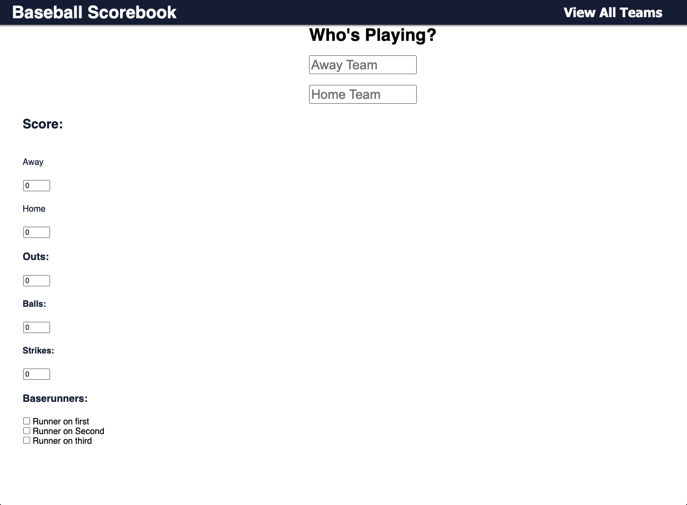
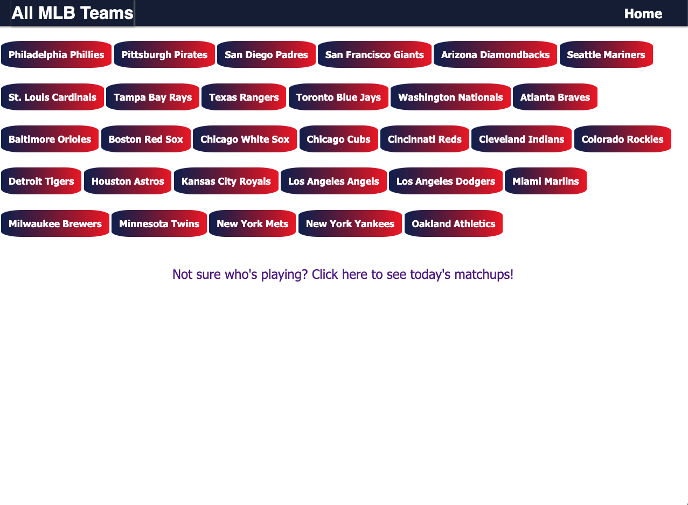

## Baseball Scorebook 

Simple app to allow users to keep track of a baseball game.

## Technologies Used
- Django
- Python
- Html
- CSS

## Screenshots

## Future Enhancements

- I plan on recreating this project as a React app. I think React is a language that is suited better for something like this. 

- Add user authentication

